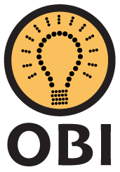

# Java


Esse é um repositório para praticar minhas habilidaes em programação competitiva, com o objetivo de ir bem na OBI e na Maratona CPS.

## Programação Competitiva 🥇

Atualmente, contém estudo dos seguintes ambientes de estudo:
```
gl-crypto/
  ├── Kaique-Palestra/
  ├── NeepsAcademy/
  ├── OBI-oficial/
  ├── Simulados-OBI/
```
